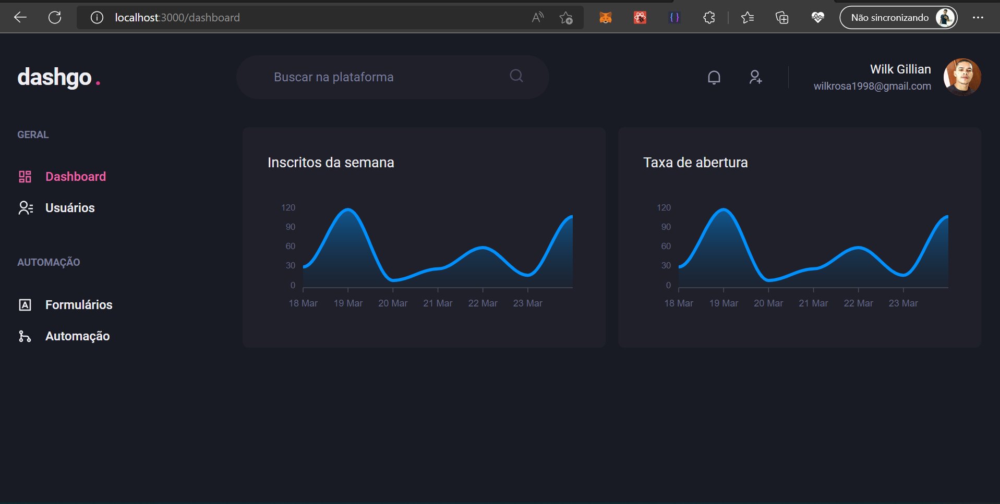

<h1>🚧 Projeto em andamento 🚧</h1>

<h1>dashgo<strong style="color: pink;">.</strong></h1>



<p>Projeto desenvolvido no curso de React da Rocketseat, o objetivo era criar uma aplicação para gerenciar 
o fluxo de usuários cadastrados na plataforma.</p>
<h2>Para visualizar o projeto

obs: necessário ter o node e o git instalado em sua máquina.

<ul>
<li>Faça um clone deste repositório:
```
git clone https://github.com/wilkgillian/dashgo.git
</li>
<li>Rode o comando:
```
npm run dev
# ou
yarn dev
```
</li>
<li>Visualize no navegador http://localhost:3000
</li></ul>

<h2>Tecnologias utilizadas</h2>
<ul>
<li><a src="https://nextjs.org/">Nextjs</a></li>
<li><a src="https://pt-br.reactjs.org/">React</a></li>
<li><a src="https://chakra-ui.com/">Chakra-ui</a></li>
<li><a src="https://www.typescriptlang.org/pt/">Typescript</a></li>
<li><a src="https://miragejs.com/">Miraje Js</a></li>
<li><a src="https://apexcharts.com/">Apexcharts</a></li>
<li><a src="https://axios-http.com/ptbr/docs/intro">Axios</a></li>
<li><a src="https://www.npmjs.com/package/yup">yup</a></li>
<li><a src="https://tanstack.com/query/v4/?from=reactQueryV3&original=https://react-query-v3.tanstack.com/">React query</a></li>
</ul>
